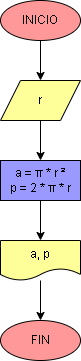

# Ejercicio No. 1: Área y Perímetro de un círculo.

El usuario ingresará cualquier número natural que hará referencia al radio del círculo. El programa debe ser capaz de realizar las operaciones necesarias utilizando las fórmulas para calcular el área y perímetro de un círculo. Para este ejercicio se puede hacer uso de una librería llamada math, para poder darle el valor a pi (π). 
Las fórmulas necesarias son:

        Área → A = math.pi * r²
        Perímetro → P= 2 * math.pi * r

