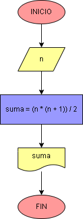

# Ejercicio No.2: Suma de los n primeros naturales.

El programa debe recibir un número entero positivo, luego realizar la operación reemplazando n por el número ingresado e imprimir el resultado en pantalla. Un ejemplo de sumar los primeros números enteros positivos es:

        suma = 5 ( 5 + 1 ) / 2 = 15
        sería lo mismo que decir:
        suma = 1 + 2 + 3 + 4 + 5 = 15

