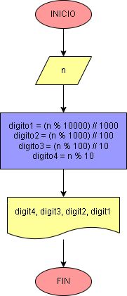

# Ejercicio No.3: Devolver número de cuatro dígitos en orden inverso

El código recibirá un número de cuatro dígitos, el cual pasará por una serie de operaciones y luego se imprimirá en pantalla el número dado vuelta. La forma en la que haremos esto será con el operador módulo, observa el siguiente ejemplo:

        		15 % 10 = 5
        		15 % 2 = 1

El “%” es el operador de modulo y devuelve el resto de una división entera, es decir, en la primera línea, si dividimos 15 entre 10 obtenemos 1 como resultado, pero el resto es 5, en la segunda línea, al dividir 15 entre 2, el resultado será 7 y el resto 1.

Teniendo también en cuenta la división entera (//), que nos da como resultado únicamente la parte entera de una división, podemos utilizar el residuo a nuestro favor:

* Para extraer la unidad → n % 10
* Para extraer la decena → (n % 100) // 10
* Para extraer la centena → (n % 1000) // 100
* Para extraer la unidad de mil → (n % 10000) // 1000

