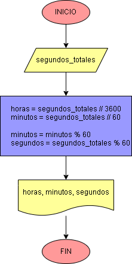

# Ejercicio No. 4: Convertir cantidad de segundos en horas, minutos y segundos.

Dentro del código: Se obtiene la cantidad de horas y de minutos, luego, como es necesario obtener la cantidad de minutos "restantes" (que no forman parte de las horas) se aplica el operador % (resto de la división). El resto de la división se aplica también para obtener la cantidad de segundos totales sin considerar los minutos.

